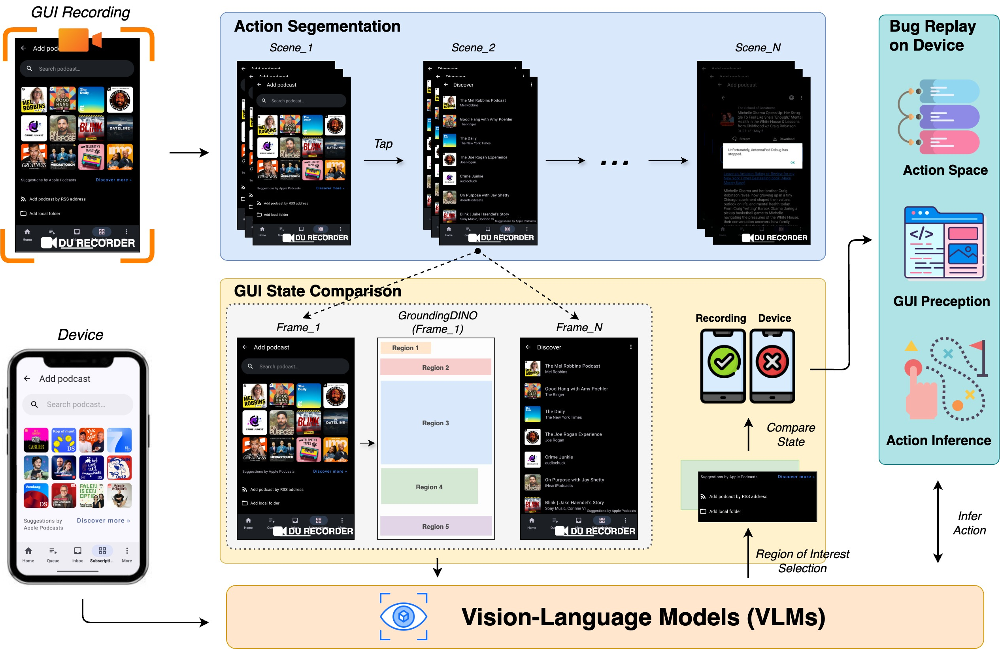

# Approach

<p align="center">
 
</p>
<p align="center">Figure: The overview of ViBR.</p>

## Overview
ViBR is built as a lightweight, fully automated system for reproducing bugs from GUI screen recordings. 
An overview of our approach is shown above and comprises three key
phases: the Action Segmentation phase, where the GUI
recording is divided into distinct scenes, each representing a
single user action; the GUI State Comparison phase, which
determines whether the GUI state associated with each scene
matches the current screen on the device; and the Bug
Replay on Device phase, which infers the intended user action
and adaptively executes it on the device to reproduce the bug.


## Running ViBR

### Prerequisites
- Python 3.13.2 installed
	- Other versions are not verified.
	- If none installed yet, can use Anaconda/Miniconda as mentioned below
- We use venv to manage python package dependencies

### Installing Anaconda/Miniconda
- We will use conda to manage python package dependencies.
- We recommend you install Miniconda from [here](https://docs.conda.io/en/latest/miniconda.html) or Anaconda from [here](https://www.anaconda.com/distribution/).
  - select "Add Anaconda to PATH" option during the install (more than one path variable is needed and this option takes care of them all).
- If freshly downloaded, you have python 3.6 or older. As mentioned earlier, upgrade to python 3.13.2 using 'conda install python=3.13.2'.

### ViBR Installation
- Clone the repository, navigate to the root and execute `pip install -r requirements.txt`.
- As we use GroundingDINO you also have to clone https://github.com/IDEA-Research/GroundingDINO in the root of our project and set it up
	- After cloning run `pip install -e .` from the GroundingDINO folder or `pip install -e . --no-build-isolation` if you run into problems with torch
	- For GroundingDINO also make sure you download the [weights](https://github.com/IDEA-Research/GroundingDINO#luggage-checkpoints) and put them in `GroundingDINO/weights`. We are using the GroundingDINO-B specifically, you can change it in `dino_detection.py`

<!-- ### Android Emulator Installation
ViBR was tested exclusively using the Emulator. While in principle the system should also work with other physical devices that appear when running `adb devices` in the command line.
- For physical devices, USB debugging must be enabled and the device connected via USB cable.
- By default, our project uses the standard emulator ID `emulator-5554`. If `adb devices` shows a different device ID, update the parameter in `segment_replay.py` at line 85 where the `ADBDeviceController` is initialized.
```

``` -->

### Android SDK Installation
- **Prerequisites**
  - Operating System: Windows, macOS, or Linux
  - Java Development Kit (JDK): Make sure you have the JDK installed on your machine. You can download it from the Oracle website and follow the installation instructions specific to your operating system.
- **Download the Android SDK**: Visit the official Android Developer website [here](https://developer.android.com/studio/index.html#command-tools) and download the Android SDK command-line tools package suitable for your operating system.
- **Extract the SDK**: Once the download is complete, extract the contents of the downloaded archive to a directory of your choice on your machine. This will be your Android SDK installation directory.
- **Set up Environment Variables**
  - **Windows**: Open the Start menu, right-click on "Computer" or "This PC," and select "Properties." In the System window, click on "Advanced system settings" on the left sidebar. In the System Properties window, click on the "Environment Variables" button. Under "System variables," click "New" and enter the following:
    - Variable name: ANDROID_HOME
    - Variable value: Path to your Android SDK directory (e.g., C:\android-sdk)
    - Click "OK" to save the variable.
    - Locate the "Path" variable under "System variables" and click "Edit." Add the following entry at the end: %ANDROID_HOME%\tools;%ANDROID_HOME%\platform-tools 
    - Click "OK" to save the changes.
  - **macOS / Linux**: Open a terminal and navigate to your home directory (cd ~). Open the .bashrc or .bash_profile file using a text editor (e.g., nano .bashrc). Add the following lines at the end of the file:
  ```
  export ANDROID_HOME=/path/to/your/Android/sdk
  export PATH=$PATH:$ANDROID_HOME/tools:$ANDROID_HOME/platform-tools
  ```
    - Save the file and exit the text editor. Run the command source .bashrc or source .bash_profile to apply the changes.
- **Install SDK Packages**: Open a terminal or command prompt and navigate to your Android SDK installation directory (cd /path/to/your/Android/sdk).
  - **Windows**: Run the following command:
  ```
  sdkmanager.bat --update
  sdkmanager.bat "platform-tools" "platforms;android-30" "build-tools;30.0.3"
  ```
  - **macOS / Linux**: Run the following command:
  ```
  ./sdkmanager --update
  ./sdkmanager "platform-tools" "platforms;android-30" "build-tools;30.0.3"
  ```
  - This will download and install the necessary SDK packages, including the platform tools, Android platform, and build tools.
- **Verify Installation**: To verify that the Android SDK installation was successful, open a terminal or command prompt and run the _adb_ (Android Debug Bridge) command. If the installation was successful, you should see the help information and a list of available commands.
### Android Device Connection for ADB
- **Prerequisites**
  - Android device: Ensure that you have several Android devices available.
  - USB cable: Prepare a USB cable to connect your Android device to your computer.
  - USB debugging: Enable USB debugging on your Android device. To do this, go to Settings > Developer options (or Developer settings), and toggle the USB debugging option.
- **Connect the Android Device**: Use a USB cable to connect your Android device to your computer. Ensure that the USB debugging option is enabled on your device.
- **Verify Device Connection**: To verify that your Android device is successfully connected to ADB, open a command prompt (for Windows) or terminal (for macOS and Linux) and run the following command:
  ```
  adb devices
  ```
  - This will display a list of connected devices. If your device is listed along with the "device" status, it means the device is connected and recognized by ADB.


### Execution of ViBR
1. Make sure you have a running Device (Emulator or Physical)
2. Prepare an OpenAI API key which you have to add in `openai_api.py`
3. Install the APP to be tested on the Device
4. Navigate to the same starting state
5. Run the script in [`segment_replay.py`](./segment_replay.py) e.g. `python .\segment_replay.py <path to video>
6. The script will also show the start and goal state additionally to a live screenshot of the device to be able to understand what its trying to execute. 

```

# video path
path_to_video = "AmazeFileManager-1558/video-#1558.mp4"

python segment_replay.py <path_to_video>
```

