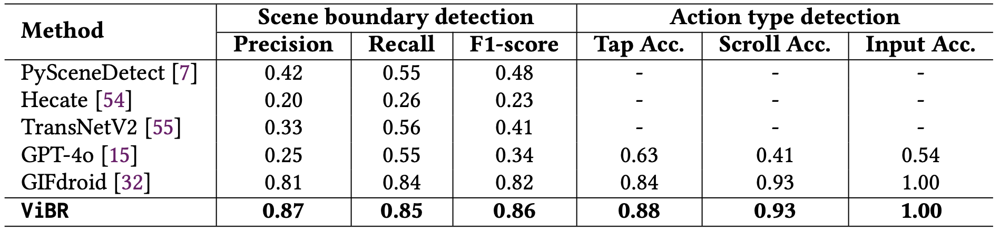
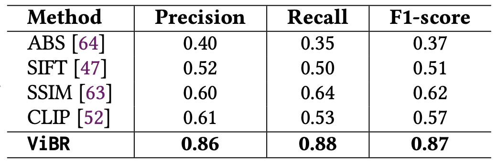
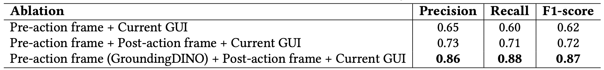
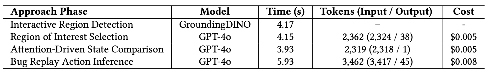

# Evaluation

We provide the experimental setup we used to evaluate ViBR in terms of its performance.

- **RQ1:** How accurate is our approach in segmenting the actions from GUI recordings?
- **RQ2:** How accurate is our approach in determining functional consistency in GUI states?
- **RQ3:** How effective is our approach in replaying the bug on device?
- **RQ4:** What is the runtime overhead of our approach for replaying a bug?

For RQ1, we evaluate the overall performance of our
approach in action segmentation and compare it against state-of-the-art baselines. For RQ2, we assess the effectiveness of
our approach in verifying GUI state consistency, determining
whether the current on-device GUI matches the recorded state
in the action scene. For RQ3, we examine the capability of
our approach to successfully replay bugs on the device.
For RQ4, we examine the runtime overhead
introduced by multiple VLM calls to understand the practicality of our
approach in real-world settings.

## Experimental Dataset Collection

To ensure
a diverse and unbiased dataset, we collect recordings from
three existing open-source datasets: (i) the crash bug reproduction dataset from Themis; (ii) the evaluation suite of
GIFdroid; and (iii) the study on Android GUI recording
V2S.

You can obtain the dataset in one of the following ways:

- Themis: [https://github.com/the-themis-benchmarks/home](https://github.com/the-themis-benchmarks/home)
- GIFdroid: [https://github.com/sidongfeng/gifdroid](https://github.com/sidongfeng/gifdroid)
- V2S: [https://sites.google.com/view/video2sceneario/home](https://sites.google.com/view/video2sceneario/home) 

## Run Experiments
For each RQ, we provide detailed, step-by-step instructions for setting up the baselines, including environment configuration, dependency installation, hyperparameter settings, and model initialization. After completing the setup, you can execute the provided Python scripts in each RQ folder to run the full set of experiments and automatically reproduce the reported results.

### Results

### RQ1: Performance of Action Segmentation
- Please check the instructions in [RQ1](./RQ1/README.md)

Table: Performance comparison for action boundary segmentation.

Our approach significantly
outperforms all baselines, 7.4% in precision, 1.2% in recall, and 4.9% in F1-score over the best-performing baseline (GIFdroid). GPT-4o exhibits the
lowest performance. 
While GPT-4o demonstrates strong
semantic understanding in many tasks, it struggles with frame-
level segmentation, primarily due to its reliance on high-level
abstraction that lacks the granularity necessary for accurately
identifying scene boundaries—particularly when user actions
involve minor but functionally significant interface changes.
Similarly, the relatively low performance of TransNetV2 is also likely due to the domain discrepancy between the natural scenes it was trained and the artificial nature of GUI recordings. 

Traditional image-processing methods, such as PySceneDetect and Hecate, achieve relatively low performance.
This is because these methods rely on low-level visual heuristics, e.g., histogram differences or aesthetic scoring, that are not well-suited to the subtle and fine-grained transitions present in GUI recordings. 
Among the baselines, GIFdroid performs best. 
However, since it relies on SSIM as a perception metric, it remains limited when segmenting actions that involve large semantic differences but exhibit only minor pixel-level intensity differences.

### RQ2: Performance of Action Segmentation
- Please check the instructions in [RQ2](./RQ2/README.md)

Table: Performance of GUI state comparison.

Our approach consistently outperforms all baselines,
achieving a 43.3% improvement
in precision, 37.5% in recall, and 40.3% in F1-score compared to the best-performing baseline, SSIM. These results demonstrate the strength of
our functionality-aware, VLM-driven comparison method over
traditional visual similarity techniques.

Table: Ablation studies of GUI state comparison.

Our ablation study further validates the contribution of
region-guided prompting. 
The Pre-action frame + Current GUI variant, which directly compares the pre-action state with the
current on-device GUI, performs the worst, achieving an average F1-score of only 0.62.
Incorporating the post-action frame improves the performance to
0.73 precision, 0.71 recall, and 0.72 F1-score, yielding gains of 8%, 11%, and 10%, respectively.
At the end, incorporating attention-aware guidance over the interactive
region of interest in our approach, Pre-action frame (GroundingDINO) + Post-action frame + Current
GUI, substantially improves performance, e.g., improving 13%, 17%, and 15% for precision, recall, and
F1-score, respectively.

### RQ3: Performance of Bug Replay
- Please check the instructions in [RQ3](./RQ3/README.md)

Table: Performance comparison for bug replay.

Our approach achieves an
average reproducibility rate of 72.0% within 302.6
seconds for execution time, significantly outperforming both V2S and GIFdroid. This improvement is largely
due to the robustness of our method against the types of
inconsistencies, such as resolution
mismatches, dynamic UI content, configuration variability, and
recording artifacts. These factors often cause baseline methods
to fail due to their reliance on fragile visual or structural
assumptions.
In addition, a key advantage of our approach lies in its
reduced reliance on auxiliary cues or complete structural
knowledge, harnessing the multi-modal reasoning capabilities of vision-
language models to achieve functionality-aware GUI matching
and robust action inference across diverse device environments
and configurations.

### RQ4: Runtime Overhead
- Please check the instructions in [RQ4](./RQ4/README.md)

Table: Runtime overhead associated with VLM calls.

For each GUI recording, ViBR invokes these components once per action scene.
First, ViBR employs Interactive Region Detection using GroundingDINO, which takes an average of
4.17 seconds per scene. Since GroundingDINO is an open-source, locally deployed object detector,
it introduces no monetary cost during execution. Following this step, ViBR performs three GPT-4o-
based reasoning tasks per action scene: (1) Region of Interest Selection (avg. 4.15s), (2) Attention-
Driven State Comparison (avg. 3.93s), and (3) Bug Replay Action Inference (avg. 5.93s). We observe
moderate input-output token usage across these calls, on average 2,362, 2,319, and 3,462 total tokens
(input + output), respectively. 
A typical bug
reproduction involving 10 action scenes would incur a total inference cost of around $0.02.