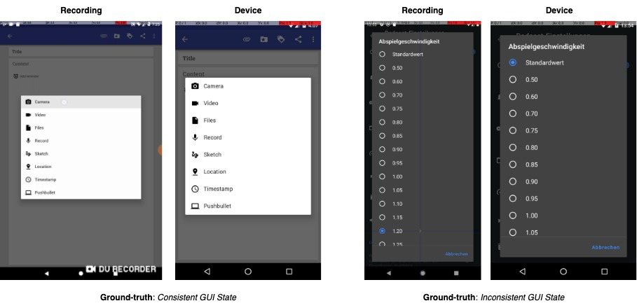

## RQ2: Performance of GUI State Comparison

To address RQ2, we evaluate the effectiveness of our method in accurately determining functional consistency between the GUI state
in each action scene and the current on-device GUI. Unlike existing datasets that focus on static
screen similarity, our evaluation emphasizes functionality-aware comparison, e.g., determining
whether the one GUI can support the same user interaction as the other, even if the appearance
differs. We compare our method against four commonly used image comparison techniques, including one pixel-level (absolute differences ABS), one structural-level (SIFT),
one perceptual-level (SSIM), and one sematic-level (CLIP). In addition, we conduct two ablation studies to assess the effectiveness of key design components
in our approach.

### Setup

1. Install dependencies
```
pip install opencv-python scikit-image numpy torch torchvision transformers
```

2. Download the dataset from [https://drive.google.com/file/d/1lony64aIi2TsC5uajHsq6IbRtu_0Y_3-/view?usp=sharing](https://drive.google.com/file/d/1lony64aIi2TsC5uajHsq6IbRtu_0Y_3-/view?usp=sharing)

3. Run a baseline comparator for SSIM, ABS, SIFT, CLIP for the GUI screenshots. For example,

<p align="center">

</p>
<p align="center">Figure: GUI screenshots from recording and device, and the ground truth label.</p>


### Results

<p align="center">

</p>
<p align="center">Table: Performance of GUI state comparison.</p>

Our approach consistently outperforms all baselines,
achieving a 43.3% improvement
in precision, 37.5% in recall, and 40.3% in F1-score compared to the best-performing baseline, SSIM. These results demonstrate the strength of
our functionality-aware, VLM-driven comparison method over
traditional visual similarity techniques.

<p align="center">

</p>
<p align="center">Table: Ablation studies of GUI state comparison.</p>

Our ablation study further validates the contribution of
region-guided prompting. 
The Pre-action frame + Current GUI variant, which directly compares the pre-action state with the
current on-device GUI, performs the worst, achieving an average F1-score of only 0.62.
Incorporating the post-action frame improves the performance to
0.73 precision, 0.71 recall, and 0.72 F1-score, yielding gains of 8%, 11%, and 10%, respectively.
At the end, incorporating attention-aware guidance over the interactive
region of interest in our approach, Pre-action frame (GroundingDINO) + Post-action frame + Current
GUI, substantially improves performance, e.g., improving 13%, 17%, and 15% for precision, recall, and
F1-score, respectively.
