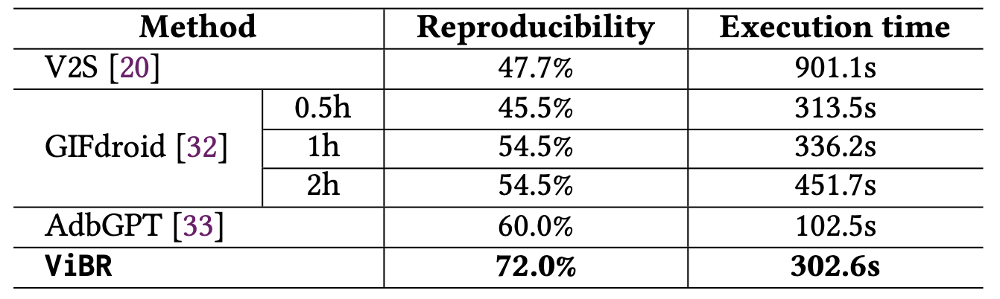

## RQ3: Performance of Bug Replay

To answer RQ3, we evaluate the
ability of our approach to effectively replay
bugs on real devices using GUI recordings. 
We evaluate performance using two metrics:
reproducibility and execution time.
We compare our approach against two state-
of-the-art bug replay techniques, V2S, GIFdroid, and AdbGPT.

### Setup

**_V2S_**

1. Install prerequisites
* Python 3.6.9 installed
    * Newer versions will not work with required version of TensorFlow.
    * If none installed yet, can use Anaconda/Miniconda as mentioned below
* git (with git lfs) installed
    * If not already existing in your installation of git, here are [git lfs installation instructions](https://help.github.com/en/github/managing-large-files/installing-git-large-file-storage)
* adb installed
    * [instructions](https://developer.android.com/studio/command-line/adb)
    * After installing, be sure to add the executable's path to your v2s configuration file.
* Enable USB debugging on your physical device/emulator
    * [instructions](https://developer.android.com/studio/debug/dev-options)

2. V2S installation
* Ensure that the environment you are running in is operating with Python 3.6.9.
* Current Option:
    * Clone the repository [here](https://gitlab.com/SEMERU-Code/Android/Video2Sceneario/-/tree/v2s-python), navigate to python_v2s directory, and execute `pip install .`. To find auxilary files necessary for running v2s, navigate to the path specified by `sys.prefix` and find v2s.
    * Run `pip show v2s` to ensure that v2s has been installed and to locate the v2s package on your system. By navigating here, you can find the packages necessary for v2s. To find auxilary files necessary for running v2s, navigate to the path specified by `sys.prefix` and find v2s.
* To be implemented at a later date:
    * `pip install v2s`

3. Replay the video
* Update v2s_config.json to list all of the video scenarios to be analyzed, or create a new configuration file following this same structure and specify the path with the `--config` option. Ensure that the detection models are correct depending on your device and that the application name is found in the app_config.json file.
* If necessary, update device_config.json to include your device specs, and update app_config.json to include the application apk and package information. The commands to determine the specs are as follows:
    * device - `adb shell getevent -t`
    * max_x, max_y - `adb shell getevent -lp`
    * width, height - `adb shell wm size`
    * X, Y, EV_ABS, X, Y, PRESS, TRACK_ID, MAJOR, EV_SYN, EV_KEY - `adb shell getevent -t` and `abd shell getevent -lt`
* When you are ready to complete the analysis, run `exec_v2s --config=<filename>` where `<filename>` is the path to the json configuration file listing all of the video scenarios to be analyzed. If no config argument is specified, the default v2s_config.json file is used, which is located at `sys.prefix` with the v2s package. In order to create your own config files, follow the structure outlined in v2s_config.json by including those fields.


**_GIFdroid_**

1. Install prerequisites
* Python 3.6.9 installed

2. GIFdroid installation
* Ensure that the environment you are running in is operating with Python 3.6.9.
* Current Option:
    * Clone the repository [here](https://github.com/gifdroid/gifdroid.git), navigate to gifdroid directory, and execute `pip install -r requirements.txt`. Please make sure you have installed all the requirements.

3. To obtain the UTG, we use Droidbot, please refer [here](https://github.com/honeynet/droidbot/tree/master) for Droidbot installation

4. Replay the video
* Input requirements:
    * video
    * utg: GUI transition graph in json format depicting the screenshots transitions
    * artifact: screenshots in UTG
* When you are ready to complete the installation, run `python main.py --video=<filename> --utg=<utg.json> --artifact=<folder> --out=<out_filename>`.

**_AdbGPT_**
1. Install prerequisites
* Python 3.10.9 installed
* ```pip install -r requirements.txt```

2. Setup OpenAI command-line interface (CLI)
```
pip install --upgrade openai
# cfgs.py
OPENAI_TOKEN = <OPENAI_API_KEY>
```

3. Set your android device screen size
```
# utils/config.py
XML_SCREEN_WIDTH = 1440
XML_SCREEN_HEIGHT = 2960
```

4. Prepare the S2R from the bug reports and install the AUT
```
# main.py
bug_description = """
1. Go to General Settings -> Form management and unselect Hide old form versions option.
2. Click on Fill Blank Form from the main menu.
"""
```

5. Run the script. You should observe the automated bug replay with LLMs with processing in loguru.log.
```
python main.py
```

## Run Experiment

> Download the dataset from [https://drive.google.com/file/d/1lony64aIi2TsC5uajHsq6IbRtu_0Y_3-/view?usp=sharing](https://drive.google.com/file/d/1lony64aIi2TsC5uajHsq6IbRtu_0Y_3-/view?usp=sharing)

Use `run_rq3.py` to launch baselines on a single video. Results are written to `evaluation/RQ3/runs/<method>/<case>/`.

Examples:

- Run all methods (V2S, GIFdroid, AdbGPT):
```
python evaluation/RQ3/run_rq3.py --video dataset/FirefoxLite-4881/video-#4881.mp4
```

- V2S only with custom config:
```
python evaluation/RQ3/run_rq3.py \
  --video dataset/FirefoxLite-4881/video-#4881.mp4 \
  --methods v2s \
  --v2s-cli exec_v2s \
  --v2s-config /path/to/v2s_config.json
```

- GIFdroid:
```
python evaluation/RQ3/run_rq3.py \
  --video dataset/FirefoxLite-4881/video-#4881.mp4 \
  --methods gifdroid \
  --gifdroid-main /path/to/gifdroid/main.py \
  --gifdroid-utg /path/to/utg.json \
  --gifdroid-artifact /path/to/artifact_dir \
  --gifdroid-out-name gifdroid_out.json
```

- AdbGPT (uses its own configured scenario; no video arg needed):
```
python evaluation/RQ3/run_rq3.py \
  --video dataset/FirefoxLite-4881/video-#4881.mp4 \
  --methods adbgpt
```


### Results

<p align="center">

</p>
<p align="center">Table: Performance comparison for bug replay.</p>


Our approach achieves an
average reproducibility rate of 72.0% within 302.6
seconds for execution time, significantly outperforming both V2S and GIFdroid. This improvement is largely
due to the robustness of our method against the types of
inconsistencies, such as resolution
mismatches, dynamic UI content, configuration variability, and
recording artifacts. These factors often cause baseline methods
to fail due to their reliance on fragile visual or structural
assumptions.
In addition, a key advantage of our approach lies in its
reduced reliance on auxiliary cues or complete structural
knowledge, harnessing the multi-modal reasoning capabilities of vision-
language models to achieve functionality-aware GUI matching
and robust action inference across diverse device environments
and configurations.